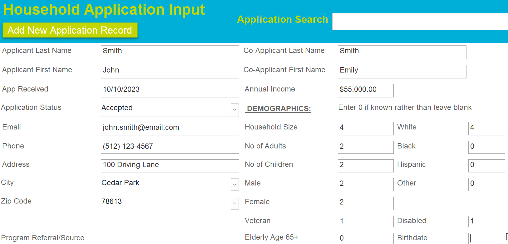
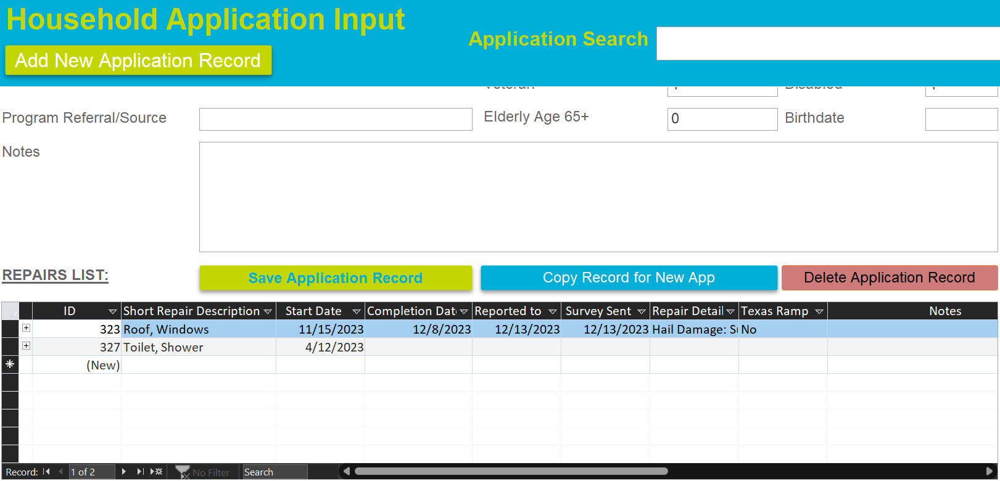
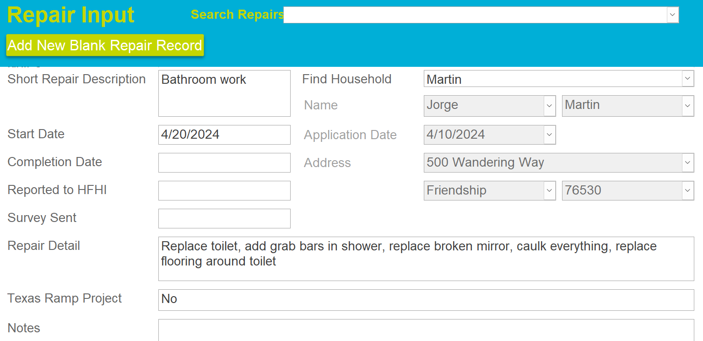
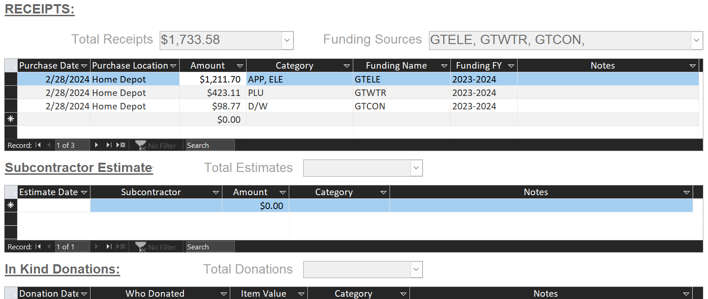
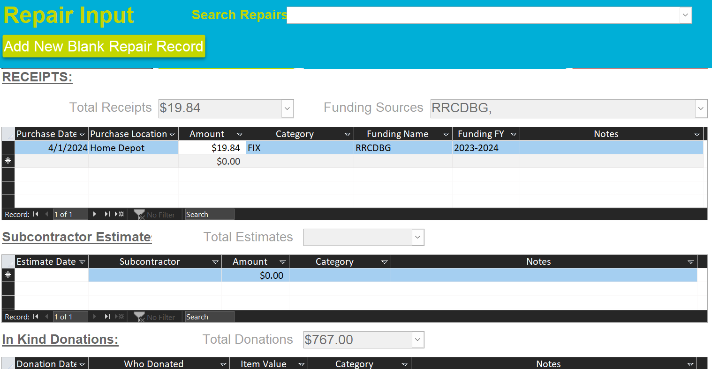
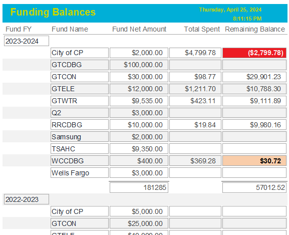
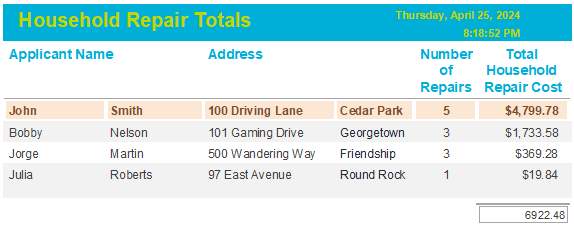
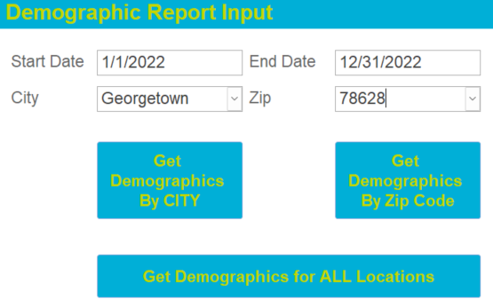
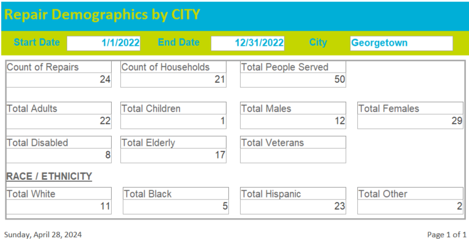

# MS Access Projects

## Repairs Database

### Background
I support an organization that does home repair for low income households that is funding by various organizations (local government and private) in which some provide money at the start of the grant period while others use a reimbursement program. Households may receive multiple repairs but applications expire after a year. There are restrictions on the total amount of support a family may receive over the lifetime of owning a property. Additionally, reporting to the funding organizations requires counting demographic information of various times within specific locations depending on the specific funding organization.

### Features
**Implemented:**
* Tables to support the following:
    * Application details (Ideally this would be normalized more than it is. For the sake of usability with this specific user group, it is not broken out further)
    * Repair Details
    * Purchase Tracking
    * Donation Tracking
    * Subcontractor Usage
    * Reimbursement Tracking
* Form to input new, modify, and copy application information including a list of repairs linked to that application
* Form that includes Pending & Waitlist Applications only
* Form to input new, modify, and copy repair information including 
    * purchase reciepts with total field and list of funding sources used
    * subcontractor estimates with total field
    * donations with total field
    * reimbursements with total field
* Form that includes In Work Repairs (Started but not completed) ONLY
* Form that includes completed repairs that have not submitted reports and surveys ONLY
* Reports
    * Total expenditure by Household (Person + Address) all time with formatting vs. limit
    * Current balance of varios funding sources
    * Demographic counts during a given time at specified locations by city or zip

**TO DO:**
* Views that easily show repairs waiting for reimbursement
* Update demographic reporting to indicate number of records without adult/child, male/female, race/ethnicity info
* Expense reporting to align with offsite bookkeeping

### DB Screenshots
**DB Relationships:**

**Household Application Input Form:**

**Repair Input Form:**

**Budget Tracking Report:**

**Household Totals Report:**

**Demographics Reporting:**

Input parameters via form 

Report opens via macro 